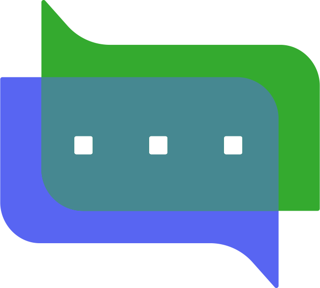

# Minecord

Bring your Minecraft world into your Discord guild

[][releases]
[][curseforge]
[][curseforge:files]

Minecord is a **Minecraft mod** that brings your Minecraft world into your
Discord guild.

It is a **server-side** only mod, uses [JDA][jda] to interface with Discord, is 
built on the [Fabric][fabric] mod loader, and is available for modern versions
of [Minecraft][minecraft] Java Edition.

## Features

### 💬 Chat

[Chat](minecord-chat/README.md) is an addon that bridges chat-related events
between Minecraft and Discord.

* Multi-channel support
* Filter events to Minecraft dimensions
* Translate unicode emojis, e.g. 😃 -> `:smiley:`
* Discord events relayed to Minecraft
  * A user sent a message
  * A user edited their recently sent message
  * A user reacted to a recent message
  * A user removed their reaction from a recent message
  * A user sent a message that contained attachments
* Minecraft events relayed to Discord
  * A player sent an in-game chat message
  * A player had died
  * A named animal/monster (with name tag) had died
  * A player unlocked an advancement
  * A player teleported to another dimension
  * A player joined the game
  * A player left the game
  * The server began to start
  * The server started and is accepting connections
  * The server began to stop
  * The server stopped and is offline
  * The server stopped unexpectedly and is inaccessible
    * Optionally attach the crash report when available

### 🪄 Commands

[Commands](minecord-cmds/README.md) is an addon that provides various
commands to interact with your Minecraft server from Discord.

* Built-in commands ready to use
  * `/uptime` &mdash; shows for how long the server has been online
  * `/tps` &mdash; displays the Minecraft server's current ticks-per-second
* Configure your own slash commands to run Minecraft commands
  * For example, you could manage your server's whitelist via `/whitelist`
* Ability to apply cooldowns to commands
  * This can be configured on a per user, channel or guild basis
* Mod developers can register their own slash commands

### 😇 Presence

[Presence](minecord-presence/README.md) is an addon that updates the bot
presence in Discord to show more detailed statuses.

* Built-in presence categories ready to use
  * `starting` &mdash; used when the Minecraft server is starting
  * `running` &mdash; used when the Minecraft server is running
  * `stopping` &mdash; used when the Minecraft server is stopping
* Configure your own presences
  * Type of activity, i.e. competing, listening, playing, streaming, or watching
  * Name of activity (supports placeholder values)
* Mod developers can register and trigger their own presence categories

### 📦 API

[API](minecord-api/README.md) is a gateway into the Minecord mod. It equips
developers with the tools necessary to integrate their mods with Discord.

## Contributing

Thank you for considering contributing to Minecord! Please see the
[Contribution Guidelines][contributing].

## Security Vulnerabilities

Please review the [Security Policy][security] on how to report security
vulnerabilities.

## Licence

Minecord is open-sourced software licenced under the [MIT licence][licence].

[contributing]: .github/CONTRIBUTING.md
[curseforge]: https://curseforge.com/minecraft/mc-mods/minecord-for-discord
[curseforge:files]: https://curseforge.com/minecraft/mc-mods/minecord-for-discord/files
[fabric]: https://fabricmc.net/
[jda]: https://github.com/DV8FromTheWorld/JDA
[licence]: https://opensource.org/licenses/MIT
[minecraft]: https://minecraft.net/
[releases]: https://github.com/axieum/minecord/releases
[security]: .github/SECURITY.md
